# Okta JML Lifecycle Automation

I	built	an	automated	joiner-mover-leaver	identity	lifecycle	in	a	free	Okta org,	modeled	on	a	fictional	bank	(Meridian	Trust	Bank).	Access	is	never assigned	to	people:	apps	bind	to	groups,	group	rules	place	people	in	groups from	their	HR	attributes,	and	the	lifecycle	runs	itself.	

## What does this demonstrate?
- Role-based	access	via	groups	and	group-bound	application	assignment
-	Attribute-driven	group	rules	(HR-driven	provisioning	pattern)
- Full	JML	lifecycle:	automated	provisioning,	mover	access	swap,	leaver deactivation	with	session	kill
-	MFA	enrollment	policy	and	hardened	password	policy
-	Least-privilege	delegated	administration
-	Audit	evidence	for	every	lifecycle	event	from	the	Okta	System	Log

## Create Okta Org
  - Step 1: Sign up and open the Admin console.
    - Go	to developer.okta.com/signup.	The	page	shows	two	products	side	by	side:	Auth0	Platform	and	Okta	Platform. Scroll down	to	the	section	headed	"Access	the	Okta	Integrator	Free	Plan"	and	click	" Sign	up	for free.	

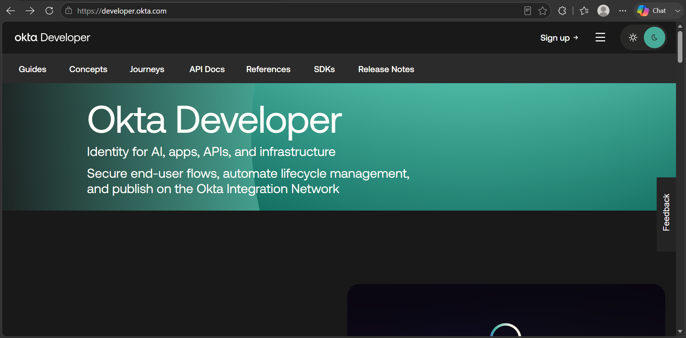
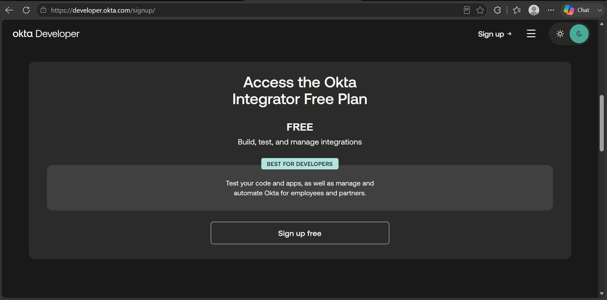
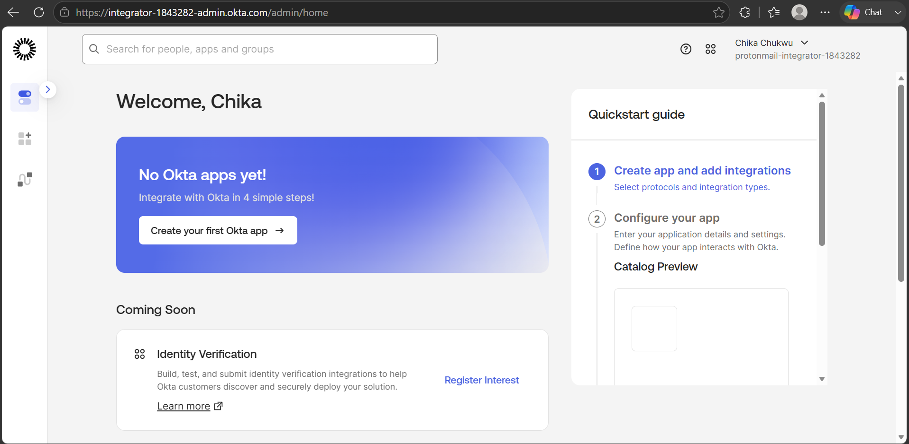

## Build groups and apps
  - Step 2: Create role groups
    - Create four groups that mirror the fictional bank structure
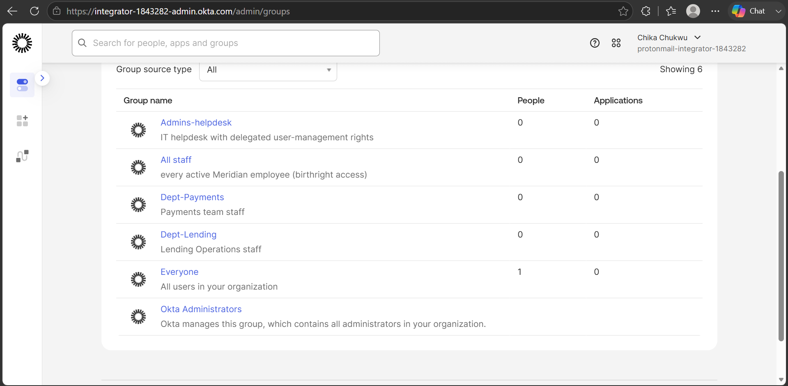

  - Step 3: Add the applications
    - Add the three applications that stand in for the fictional bank's systems.
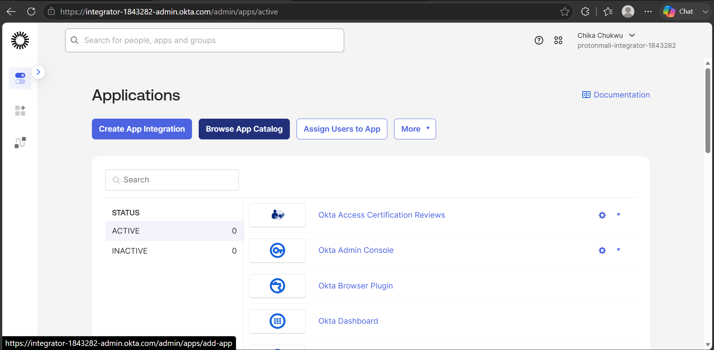
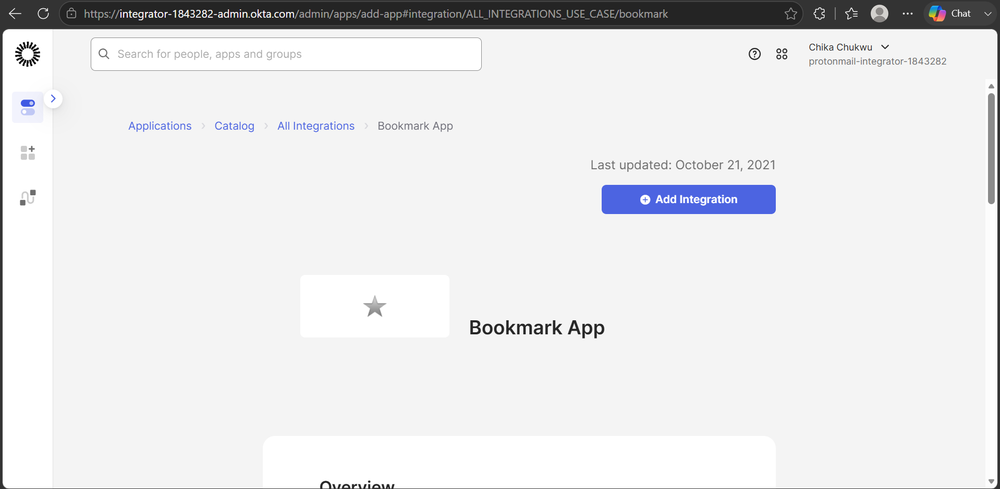
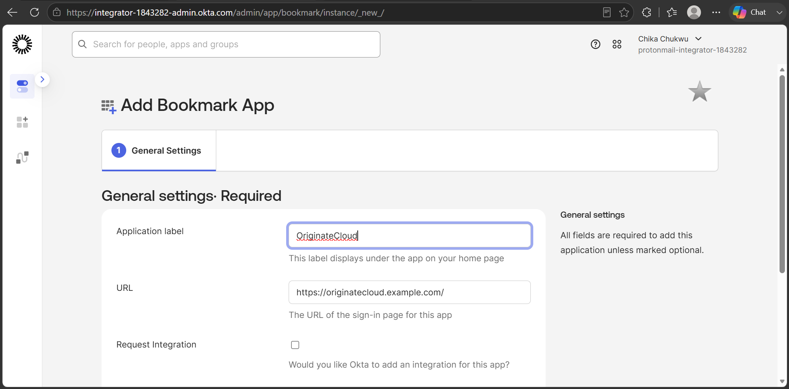
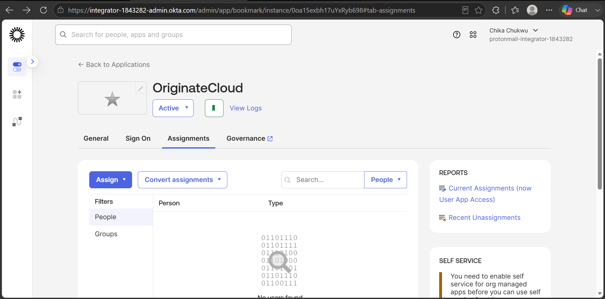
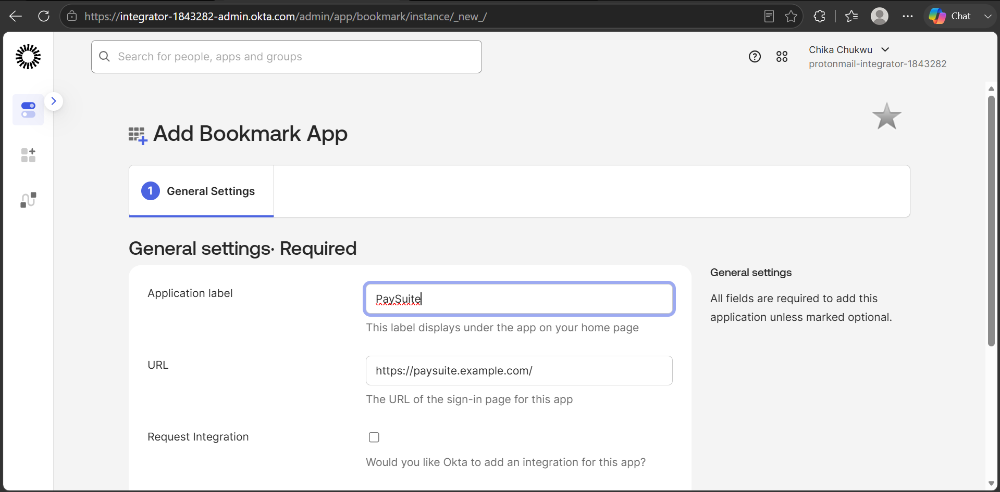
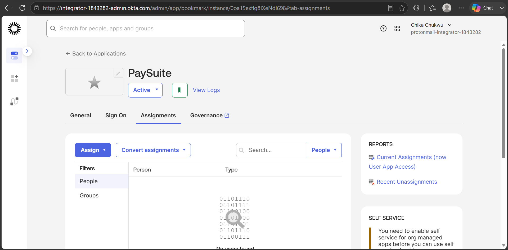
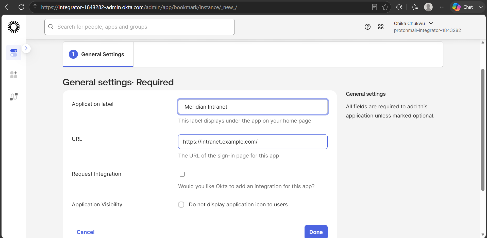
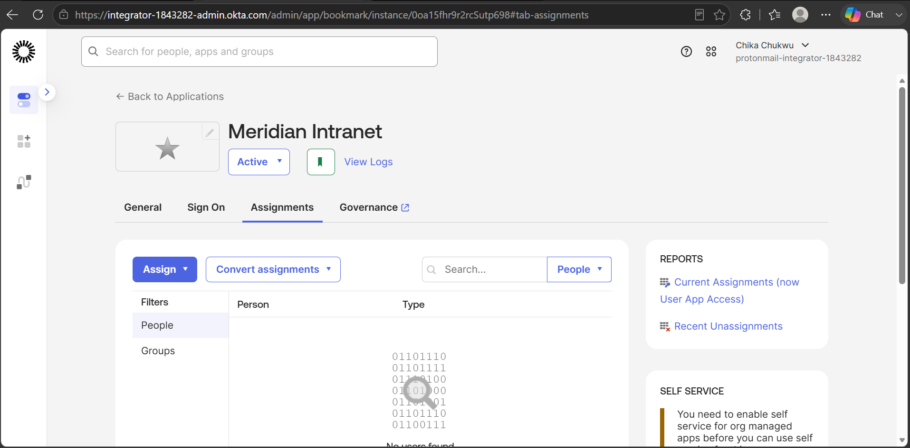

  - Step 4: Link the apps to the groups
    - Assign each app to groups, not people.

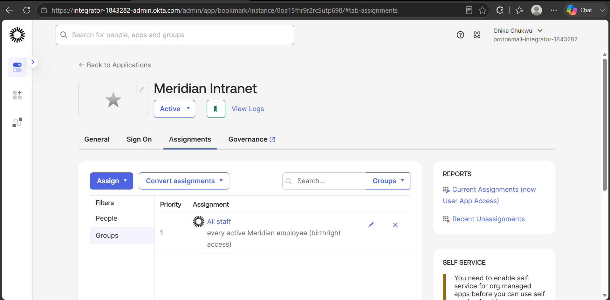
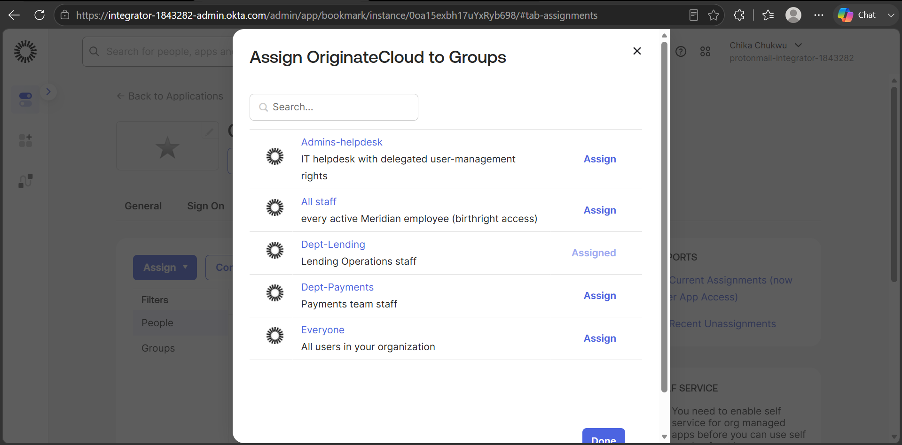
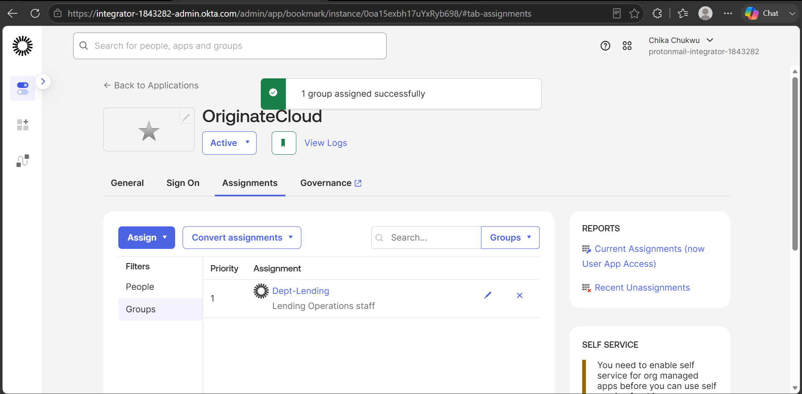
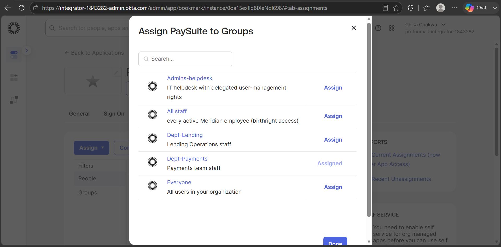
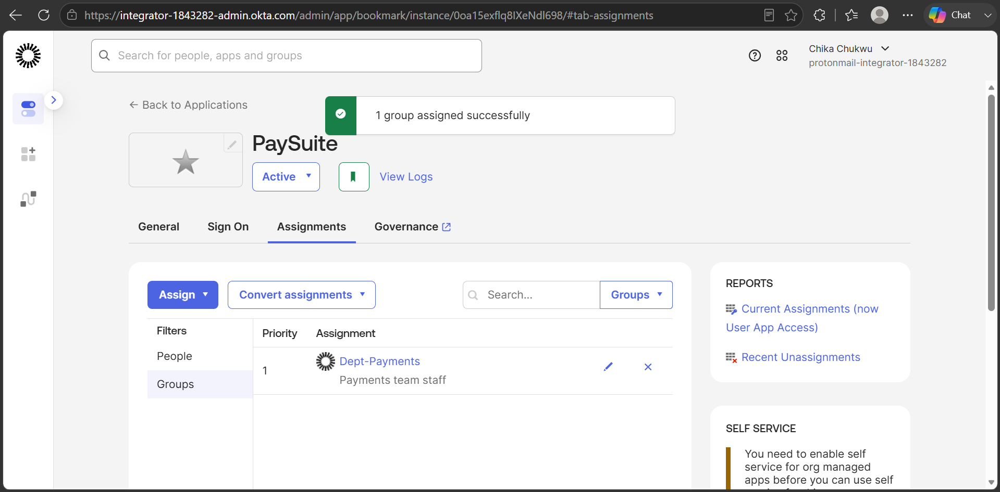
